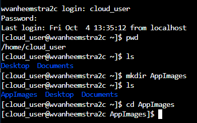
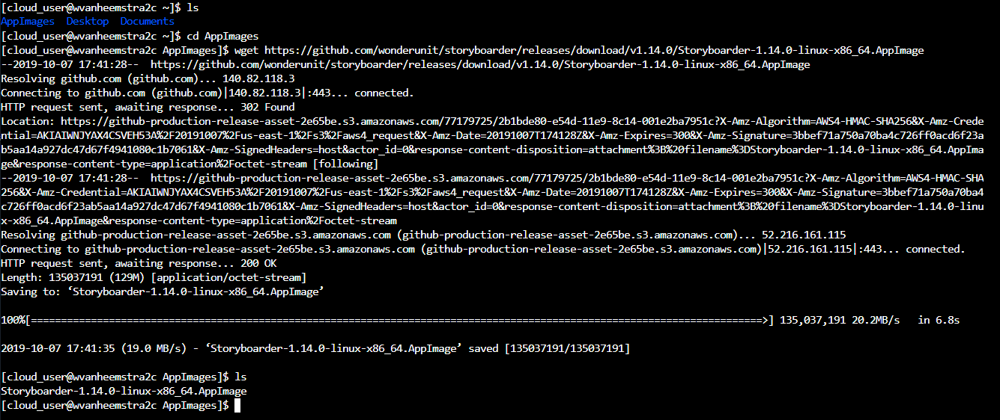
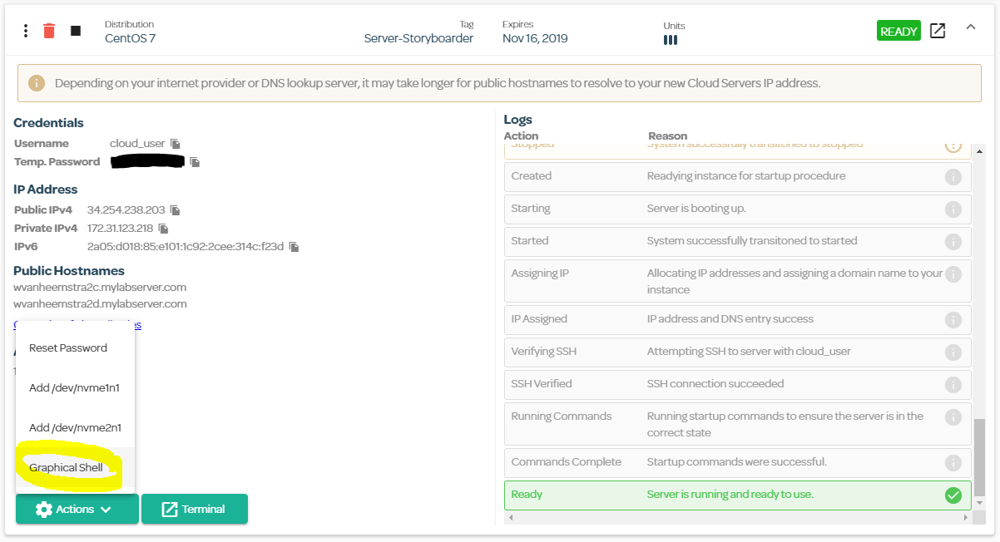
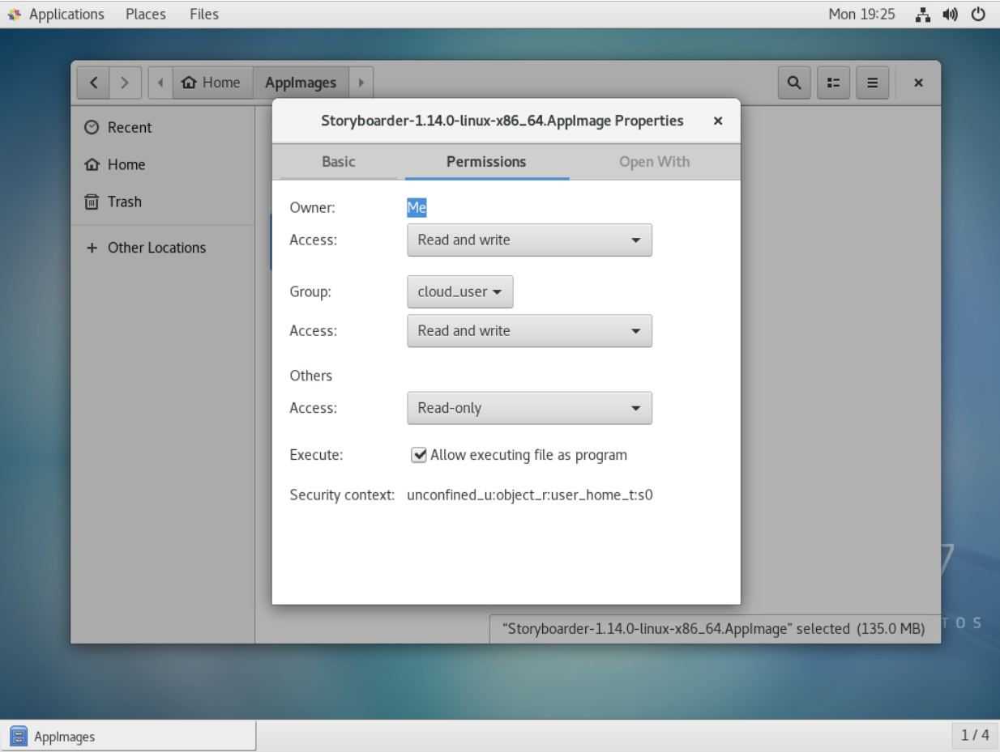
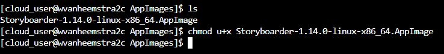
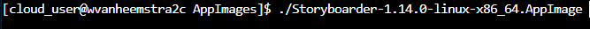
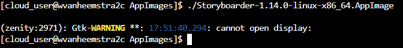
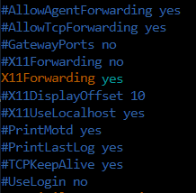
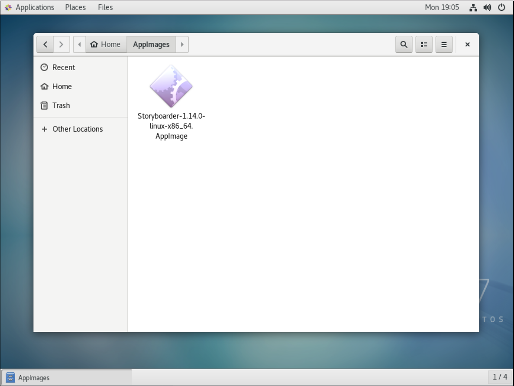

# Storyboarder

Based on https://wonderunit.com/storyboarder/

Storyboarder is a free tool to create storyboards.

This repository describes how to run it using a Linux vm in Linux Academy

- Browse to https://linuxacademy.com/

- Login with your account (otherwise sign up first)

You will be forwarded to the Dashboard at https://app.linuxacademy.com/dashboard

## Installing Storyboarder on a virtual machine (vm) on Linux Academy

Follow this tutorial: 

https://linuxacademy.com/blog/cloud-playground/cloud-playground-for-beginners-navigating-your-first-server/

### Step 1 – Create Your First Server
To get started, click on the Cloud Playground icon in the top navigation menu.


Follow the instructions on-screen to create your first server. Please select CentOS as the distribution, otherwise, some of the commands used in this guide won’t work properly.


Once you’ve completed the rest of the steps in the on-screen walkthrough, your server will be launching. Once the server is “READY” we can go ahead and log into it to complete the rest of this guide.


### Step 2 – Log into the server

Click on the server you just launched, and you will find a “Terminal” button towards the bottom. This will open an in-browser terminal for you to log into this server, so go ahead and click it. The great thing about this in-browser terminal is that it bypasses restrictions that corporate firewalls typically have, so you can learn on the job without restriction.


Once your in-browser terminal loads, it will ask you for your username and then for your password. You will find your credentials under the “Credentials” section, as pictured above.

Please keep in mind that your temporary password will be different than the one pictured above, so copy it directly from your screen.
Also note that even though you don’t see it on the screen, keystrokes are being registered when you type in your password. It’s not visible for extra security measures, because that way you can’t see the letters or the length of the password being typed. So again, don’t worry if you are typing your password and nothing appears to be happening — it’s definitely registering the keystrokes!

Once you log in, it will immediately ask you to change your password. It does this by asking you to first enter the current password (the one you just entered from the “Temp. Password.”). Only then will it ask you to enter the new password, and it will ask you to confirm a second time.


That’s it! You’ve now created your own custom password which you will use to login and to access admin privileges on this server going forward. Don’t forget this password!


Great, we’re now ready to type commands and play around!

### Step 3 - Download and Install Storyboarder

Storyboarder can be downloaded from either their web site at https://wonderunit.com/storyboarder/ or directly from their Github repository (e.g. https://github.com/wonderunit/storyboarder/releases/download/v1.14.0/storyboarder-setup-1.14.0.exe)

For here, browse the Github repository at https://github.com/wonderunit/storyboarder/releases/ to select the right version for the OS (here: *latest-linux.yml*)

Instead of either installing a binary file or from source, Storyboarder has a so-called AppImage. Hence, we will use this file to install Storyboarder. Follow below instructions:

#### Install using AppImage

Based on "How To Use AppImage in Linux [Complete Guide]" at https://itsfoss.com/use-appimage-linux/

There are ways to install software in Ubuntu or any other Linux distribution. Downloading .deb or .rpm files and double click on them to install software is one of the most convenient way to that.

Recently, you might have noticed that some applications are downloaded with an extension .appimage. And you may wonder what are these .appimage files.

Next shows you what is an AppImage and how to use AppImage to install applications in Linux. In addition to that, I will also tell you a few things that you should keep in mind while using AppImage.

##### A. What is AppImage

For years, we have DEB packages for Debian/Ubuntu based Linux distributions and RPM for Fedora/SUSE based Linux distributions.

While these packages provide a convenient way of installing software to their respective distribution users, it is not the most convenient for the application developer. The developers have to create multiple packages for multiple distributions. This is where AppImage comes into picture.

[AppImage](http://appimage.org/) is a universal software package format. By packaging the software in AppImage, the developer provides just one file ‘to rule them all’. End user, i.e. you, can use it in most (if not all) modern Linux distributions.

*AppImage doesn’t install software in the traditional way*

A typical Linux software will create files at various places, requiring root permission to make these changes to the system.

AppImage doesn’t do it. In fact, AppImage doesn’t really install the software. It is a compressed image with all the dependencies and libraries needed to run the desired software.
 
You execute the AppImage file, you run the software. There is no extraction, no installation. You delete the AppImage file, the software is removed (we’ll see about it later). You can compare it to .exe files in Windows that allow you to run the software without actually going through the installation procedure.

Let me list some of the features or benefits of AppImage.

*AppImage features*

- Distribution agnostic: Can run on various different Linux distributions
- No need of installing and compiling software: Just click and play
- No need of root permission: System files are not touched
- Portability: Can be run anywhere including live disks
- Apps are in read only mode
- Software are removed just by deleting the AppImage file
- Applications packaged in AppImage are not [sandboxed](https://en.wikipedia.org/wiki/Sandbox_(computer_security)) by default.

##### B. How to use AppImage in Linux

Using AppImage is fairly simple. It is done in these 3 simple steps:

- Download AppImage file
- Make it executable
- Run it

Don’t worry, I’ll show you how to run AppImage in details. I am using CentOS in this AppImage tutorial but you can use the same steps on other Linux distributions as well. After all, the entire point of AppImage is to be independent of the distributions.

##### Step 1: Download .appimage package

There are plenty of software that are available in AppImage format. GIMP, Krita, Scribus and OpenShot are just a few names. You can find an extensive list of applications available in AppImage format [here](https://github.com/AppImage/AppImageKit/wiki/AppImages).

I will be using *Storyboarder* in this tutorial. You can download it from its [website](https://wonderunit.com/storyboarder/).

= EXPLAIN HERE HOW TO DOWNLOAD STORYBOARDER ON OUR VM =

The URL to browse for the version of and Operating System supported by Storyboarder is: https://github.com/wonderunit/storyboarder/releases/

Browse to the downloads, we pick the following as an example:

https://github.com/wonderunit/storyboarder/releases/download/v1.14.0/Storyboarder-1.14.0-linux-x86_64.AppImage

To download above version on our Linux CentOS server, run the following command on that server:



```
cd ~
mkdir AppImages
cd AppImages
```




```
wget https://github.com/wonderunit/storyboarder/releases/download/v1.14.0/Storyboarder-1.14.0-linux-x86_64.AppImage
```

##### Step 2: Make it executable

By default, the downloaded AppImage file won’t have the execution permission. You’ll have to change the permission on the file to make it executable. You don’t need root privilege to do that.

Use the Graphical Shell in Linux Academy Playground of our server-storyboarder:



If you prefer the graphical way, just right click on the downloaded .appimage file and select Properties.

(

In the next screen, go to the Permissions tab and check the box that says “Allow executing file as program”.

- SCREENSHOT HERE - 


That’s it. You have made the file executable.

Alternatively, if you prefer the command line, you can simply use chmod u+x <AppImage File> to make it executable.
 
```
chmod u+x <AppImage File>
```



##### Step 3: Run the AppImage file

Once you have made the AppImage file executable, just double click on it to run it. It will see the software running as you would have installed it on your system. Cool, isn’t it?

One can run the AppImage directly from the command line as follows:

```
./Storyboarder-1.14.0-linux-x86_64.AppImage
```



What if you see following error:



Suggestion:

You should let your ssh-server forward x11 display
update /etc/ssh/sshd_config and set X11Forwarding yes, then restart your ssh server

```
cd /etc/ssh/
sudo vi sshd_config
```

In vi set X11Forwarding to yes, then save and close sshd_config with :qw! 



Restart the server for above changes to take effect.

Then try to run the Storyboarder AppImage again.

```
./Storyboarder-1.14.0-linux-x86_64.AppImage
```

If all else fails, just use the Graphical Shell in Linux Academy Playground of our server-storyboarder:


From the Home directory, open AppImages, then double-click Storyboarder.



##### C. How to uninstall AppImage software
Since the software is never installed, there is no need of ‘uninstalling’ it. Just delete the associated AppImage file and your software is removed from the system.

##### D. Things to remember while using AppImage in Linux
There are few additional things about AppImage that you should know.

###### 1. Desktop integration

When you run AppImage file, some software may prompt you to ‘install a desktop file’.  If you select yes, your AppImage will be integrated with your Linux system like a regular installed application.

- SCREENSHOT HERE -
Some software provide desktop integration

Which means that your software will be searchable through Unity or GNOME. You can find it in menu and lock it to the Plank or Launcher.

- SCREENSHOT HERE -
Storyboarder after desktop integration

###### 2. Desktop integration may require manual cleanup post removal

If you choose desktop integration, you’ll have a few files created in your system. The file size will only be in a few Kb though. When you delete the AppImage file, these desktop files remain in your system. You may leave it as it is or delete it manually.

###### 3. Choose where you put the AppImage files

The downloaded AppImage files should arrive in the Download folder. But this might not be the best place to keep it as it gets cluttered over time. It is better to keep them in a separate directory for easier management.

Also keep in mind that if you chose desktop integration and then moved the AppImage file to some other location, you’ll have to remove the desktop files first. Else the desktop integration might not work.

###### 4. Update is not always an option

Maybe some software will check for updates automatically and notify you about the availability of a newer version. But that’s not going to happen most of the time.

There is a command line option to check and update the software but that too depends if the developer provided this option or not.

In short, there is no automatic updates here. You’ll have to find your own if there is a newer version of the software available.

#### Conclusion

There are other “universal Linux apps” such as Snap by Ubuntu and Flatpak by Fedora.  Since this article was about using AppImage, I didn’t go into the Snap vs Flatpak vs AppImage debate.

To me, AppImage is a nice way to use software across Linux distributions. I do hope that the update process improves here to make it much more useful for end users.
